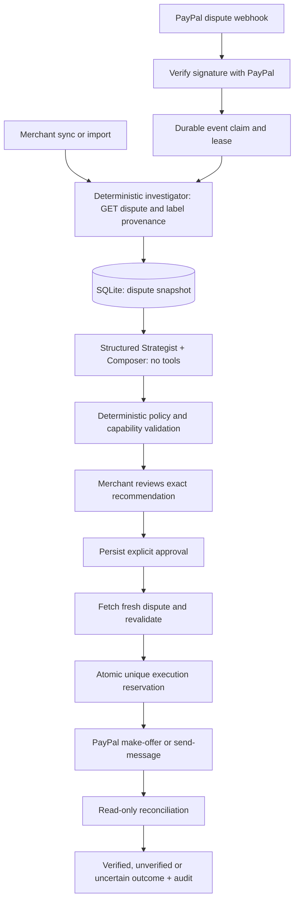

# Parley implementation architecture

As implemented on 2026-10-03. Next.js 16.3.8, React 19, TypeScript, Prisma 6.19/SQLite, Zod, OpenAI SDK, and direct PayPal sandbox REST.

## Responsibility boundaries

| Module         | Responsibility                                                                                    | Authority                                                  |
| -------------- | ------------------------------------------------------------------------------------------------- | ---------------------------------------------------------- |
| `domain.ts`    | Zod schemas, integer currency conversion, evidence extraction, policy and capability checks       | Pure deterministic functions                               |
| `paypal.ts`    | OAuth, fixed sandbox host, reads, bounded mutations, signature verification, result comparison    | No arbitrary URLs; no POST retry                           |
| `ai.ts`        | One structured model request for strategy and composed message; explicit demo fixture alternative | No tools, secrets, policy writes, or financial authority   |
| `store.ts`     | Case namespace, snapshot fingerprint, persistence and read models                                 | Invalidates unexecuted recommendations when records change |
| `workflow.ts`  | Analyze, decide, execute, reconcile, policy update                                                | Server-side approval and state enforcement                 |
| `webhook.ts`   | Signature verification, event uniqueness, lease, retryable processing                             | Can fetch/analyze; never approves or executes              |
| `http.ts`      | Signed session, constant-time checks, origin validation, bounded body parsing, safe errors        | API perimeter                                              |
| `components/*` | Evidence/recommendation/approval workspace                                                        | Never holds credentials or constructs PayPal requests      |

The investigator is deterministic orchestration, not an LLM agent. Strategist and Composer share one model request because they use the same context; splitting them would add latency without a distinct tool responsibility. Activity events represent persisted operations, not hidden chain-of-thought.

`AI_PROVIDER` selects local Ollama (default), Gemini, or OpenAI explicitly. Local inference calls the fixed loopback `/api/chat` endpoint with `qwen3:4b`, `think:false`, schema-constrained output, 16k context, a 12,000-byte input cap, and a 90-second timeout; no cloud credentials are sent. Gemini uses Google's fixed OpenAI-compatible Chat Completions endpoint with `zodResponseFormat`; OpenAI uses Responses with `zodTextFormat` and `store:false`. Keys are provider-specific. All providers reject incomplete/refused/malformed output and unknown evidence, expose no tools, and make no automatic provider fallback. Provider/model identifiers are saved with the recommendation. Free-tier Google projects have quota limits and data-use terms; account billing settings, not this app, determine whether Google usage is free.

## Data model

- **MerchantPolicy:** one per environment; immutable human-approval requirement, versioned rules.
- **DisputeCase:** environment-prefixed key, normalized snapshot, SHA-256 fingerprint, revision, status.
- **AgentRun:** provider, run status, start/end timestamps.
- **Recommendation:** immutable payload, evidence citations, snapshot fingerprint, policy version, validation, provider, status.
- **Approval:** unique recommendation reference, decision, merchant actor, timestamp.
- **PayPalAction:** unique case and recommendation references, UUID, exact request plus before-snapshot, state, HTTP status/debug ID, outcome.
- **WebhookEvent:** unique PayPal event ID in sandbox namespace, processing state, attempt count, three-minute lease.
- **AuditEvent:** related case, actor, event, concise description, timestamp. Application has no delete/update endpoint.

Transaction/evidence data are embedded in the case snapshot because they are supplied by the Disputes API and have no separate editing workflow. No unused Merchant/Transaction/Shipment entities were added. A future multi-tenant implementation must add explicit merchant ownership to every entity and credential scope.

## State and concurrency

Case flow: `NEW → ANALYZING → AWAITING_APPROVAL | NEEDS_REVIEW | ANALYSIS_FAILED`; approval moves to `APPROVED`; execution reserves `EXECUTING`, then `ACTION_RECORDED` or `NEEDS_RECONCILIATION`. `ACTION_RECORDED` describes operational work, not PayPal resolution.

Recommendation flow: `PENDING → APPROVED | REJECTED | STALE`; unsafe output becomes `BLOCKED`; execution consumes approved status as `EXECUTING`. Old recommendations remain stored. Policy changes invalidate pending/approved recommendations. Provider changes invalidate them by fingerprint. Thirty-minute expiry is enforced at approval and execution.

Action flow: `EXECUTING → ACKNOWLEDGED → VERIFIED | UNVERIFIED`; errors become `UNCERTAIN`. Demo uses `SIMULATED`. A unique case key prevents a second dispatch even after a crash. A crash after reservation but before dispatch can require manual review: this is a deliberate safety/availability tradeoff. No exactly-once claim is made across an external network. Changes in PayPal between the last GET and POST are governed by PayPal's own action validation; the app cannot atomically lock PayPal.

A read-back must contain a new matching seller offer (type, currency, amount, exact note) or message absent from the saved before-snapshot. A changed status, acknowledgement, preexisting offer, or unrelated buyer message is insufficient. Missing observable fields stay unverified.

Webhook flow: verify first, acquire unique event lease, fetch canonical dispute from PayPal, analyze actionable new/failed cases, mark processed. Replays return duplicate; active leases return 503 for safe retry; failures mark failed for retry. No action is ever executed from a webhook. Receipt does not trust the payload as the canonical dispute state.

## Auth, privacy and deployment

Sandbox requires a strong shared merchant token and signed expiring HttpOnly cookie; mutations also require exact configured Origin. Request bodies are size-limited. React escapes external text; no raw HTML rendering. Logs contain error types/status only. Credentials are never included in AI context. The app only targets `api-m.sandbox.paypal.com` and never follows arbitrary capability URLs. Session key rotation invalidates cookies.

One Node process and persistent SQLite disk are the supported deployment. Edge rate limiting and TLS are operational requirements for public hosting. Queue workers, additional merchant tenants, production credentials, retention controls, immutable external audit storage, and PostgreSQL require further engineering.

## Merchant-written message revisions

`POST /api/cases/:id/draft` accepts the editor's case revision, policy version, base recommendation ID (nullable), and exact buyer text. Origin and session checks run before dispatch. A fresh PayPal read and one database transaction reject stale/concurrent editors, ongoing analysis, and any existing action. The server constructs only SEND_MESSAGE with zero amount and null offer type. The client cannot choose provider or supply approval or financial fields.

Each save creates an immutable `MERCHANT_DRAFT` recommendation and a DRAFT_SAVED audit event, preserving older payloads and approvals but marking superseded recommendations STALE. Approval/execution revalidate authoritative stored provenance: model confidence is not applicable to human authorship, while every other boundary remains. The display explicitly labels merchant authorship and hides the model confidence percentage. Saving and approving are distinct from executing; all messages use the existing single-attempt executor and read-back checks. No database migration is required.
